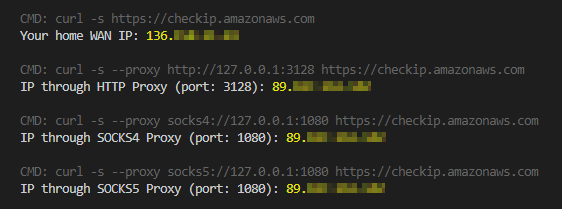

# CPTO

**Containerized HTTP/SOCKS Proxy Through OpenVPN**



Exposes HTTP and SOCKS proxy ports on your host that forward traffic through an OpenVPN client running in a container. Ideal when you need selective VPN routing — only the traffic you explicitly proxy goes through the VPN; your host machine stays on its normal network.

> **WARNING:** Made for personal/educational use. Do **not** use in production or commercial deployments.

---

## Architecture

```
[you / your app]
      │
      │  HTTP  :3128
      │  SOCKS :1080
      ▼
  [ haproxy ]  ◄─── only container with published ports
      │
      ├──► [ tinyproxy :3128 ]  ─┐
      │                           ├─ both share openvpn's network namespace
      └──► [ srelay    :1080 ]  ─┘
                                  │
                              [ openvpn ] ──► VPN / internet
```

- **openvpn** — runs the VPN client; owns the network namespace
- **tinyproxy** and **srelay** — HTTP and SOCKS5/4 proxy daemons that run *inside* openvpn's network namespace, so all their traffic exits through the VPN
- **haproxy** — the only service with published ports; proxies inbound connections to tinyproxy/srelay via the openvpn service network

Also demonstrates:
- Pod-like container networking with `network_mode: service:` ([docs](https://docs.docker.com/compose/compose-file/compose-file-v2/#network_mode))
- YAML anchors and aliases in `docker-compose.yaml` ([guide](https://medium.com/@kinghuang/docker-compose-anchors-aliases-extensions-a1e4105d70bd))
- Docker multi-stage builds ([docs](https://docs.docker.com/develop/develop-images/multistage-build/))
- Alpine-based images ([alpinelinux.org](https://alpinelinux.org/about/))
- Lightweight open-source proxy tools:
  - **tinyproxy** — HTTP proxy ([site](http://tinyproxy.github.io/) / [github](https://github.com/tinyproxy/tinyproxy))
  - **srelay** — SOCKS4/5 proxy ([site](https://socks-relay.sourceforge.io/))
  - **haproxy** — TCP load balancer / frontend ([site](http://www.haproxy.org/) / [github](https://github.com/haproxy/haproxy))

---

## Usage

### Step 1 — Clone

```bash
git clone git@github.com:jpbaking/cpto.git
cd cpto
```

### Step 2 — Configure

Edit `.env` to match your OpenVPN setup:

```bash
# Directory containing your OpenVPN client config (mounted read-only into the container).
# Leave as-is if you're passing everything via OPENVPN_CMD_ARGS.
OPENVPN_CONFIG_DIR="./.openvpn"

# Arguments passed directly to the openvpn command.
# Working directory inside the container is the mounted OPENVPN_CONFIG_DIR.
OPENVPN_CMD_ARGS="--config client.ovpn --auth-user-pass client.pass --auth-nocache --remote-random"

# Host port for HTTP proxy (tinyproxy)
HTTP_PROXY_PORT="3128"

# Host port for SOCKS4/5 proxy (srelay)
SOCKS_PROXY_PORT="1080"
```

Put your `.ovpn` config file (and any credential files) into the directory specified by `OPENVPN_CONFIG_DIR`.

### Step 3 — Run

Use `compose.sh` — a thin wrapper around `docker-compose` that always sets `--project-name=cpto`:

| Action | Command |
|---|---|
| Start (pre-built images) | `./compose.sh pull && ./compose.sh up --detach --no-build` |
| Start (build locally) | `./compose.sh up --detach --build` |
| Stop | `./compose.sh down` |
| Status | `./compose.sh ps` |
| Logs | `./compose.sh logs -f --tail 100` |
| Rebuild only | `./compose.sh build` |

### Step 4 — Verify (optional)

Run `test.sh` to confirm traffic is routing through the VPN:

```
CMD: curl -s https://checkip.amazonaws.com
Your home WAN IP: 111.111.111.111

CMD: curl -s --proxy http://127.0.0.1:3128 https://checkip.amazonaws.com
IP through HTTP Proxy (port: 3128): 222.222.222.222

CMD: curl -s --proxy socks4://127.0.0.1:1080 https://checkip.amazonaws.com
IP through SOCKS4 Proxy (port: 1080): 222.222.222.222

CMD: curl -s --proxy socks5://127.0.0.1:1080 https://checkip.amazonaws.com
IP through SOCKS5 Proxy (port: 1080): 222.222.222.222
```

The two IPs should differ — your home WAN IP vs. the VPN exit IP.
